# Unified Tagging - Summit 2018 Testing

 ## Introduction:
Thank you for participating today. We are conducting research on a new UI component that allows users to narrow down a data set they’re viewing. Throughout this study, we’ll be giving you a few tasks. While you’re working, please tell me what you’re thinking, describe the steps you’re taking, what you expect to see, and why you’re doing things. It’s important that you’re open and honest with your feedback.

First I’d like to gather some basic info about you:

1. Job / Role / Occupation
2. Company
3. Years of experience
4. Red Hat products used

## Interview

5. Do you use tagging in your enterprise IT applications?
  * Yes / No
6. Can you think of other use cases when you use tagging?
7. How does tagging things in the application help you?
8. Can you follow up on that?
  * We want to make sure we understand why people actually tag things
9. What is the purpose of tagging?

Now we’ll start the test! We will start on an interface where the user has selected one VM. I’ll give you a scenario, then you’ll click on the prototype on the screen to accomplish a task. This is a prototype, so some areas will not be clickable - if you click on something that doesn’t respond, please let me know and tell me what you expected to happen. Any questions?

## Task 1
*Imagine you are an administrator and you’re in the process of interacting with one VM and you want to assign it a tag. That tag will be for the Development environment , so you want the tag to reflect those attributes. Use the prototype to do this.*

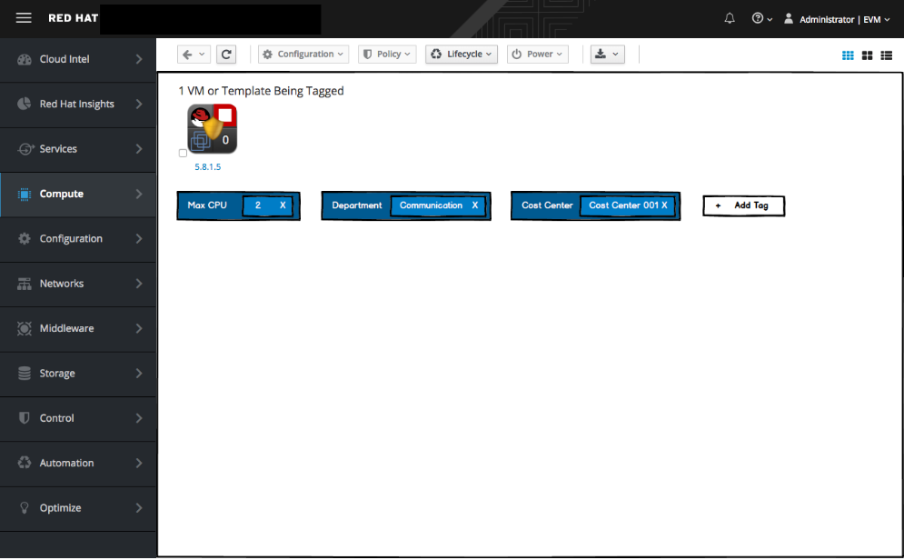

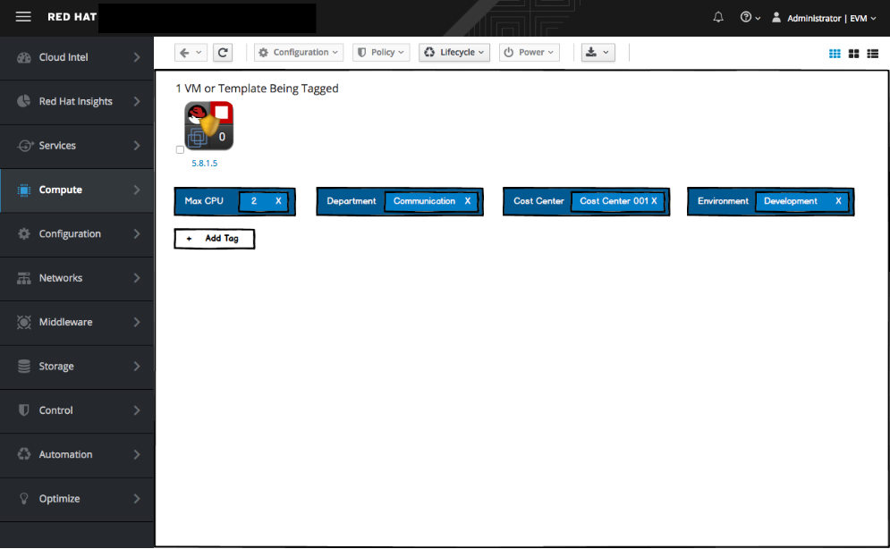

* How would you describe how difficult or easy it was to complete this task? (Very Difficult - Very Easy)
* How satisfied are you with using this application to complete this task? (Very Dissatisfied - Very Satisfied)
* How would you rate the amount of time it took to complete this task? (Too Much Time - Very Little Time)
* Did you understand how to add a new tag?
* Was it easy enough for you to assign the tag?
* Can you think of any use case when you assign a tag to an attribute?

## Task 2
*For the next task, you want to add a location tag. In this case, the VM is located in both Paris and Rome. Please add an appropriate tag.*

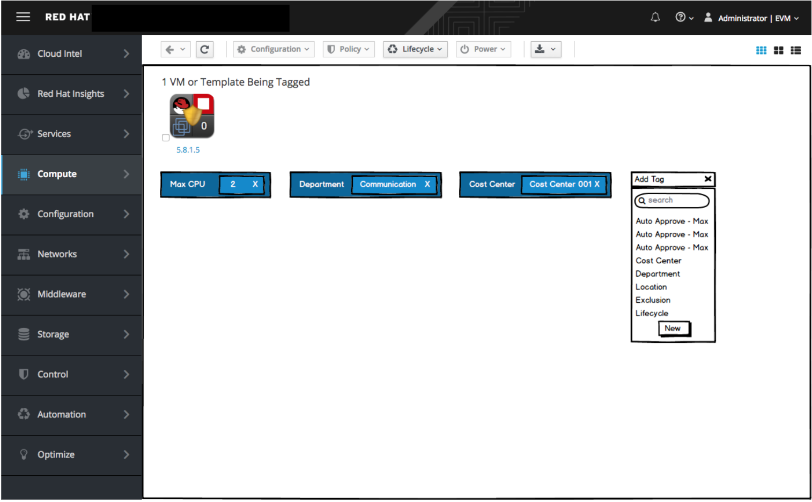

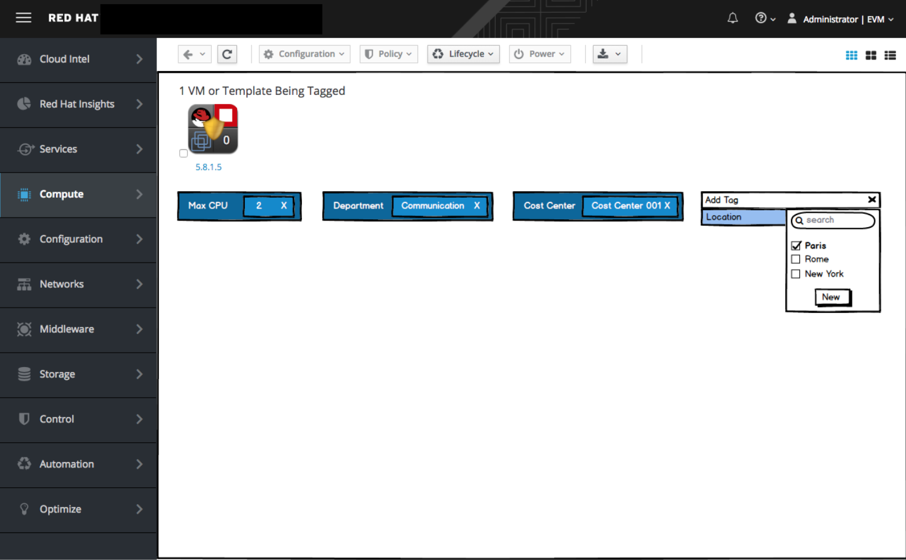

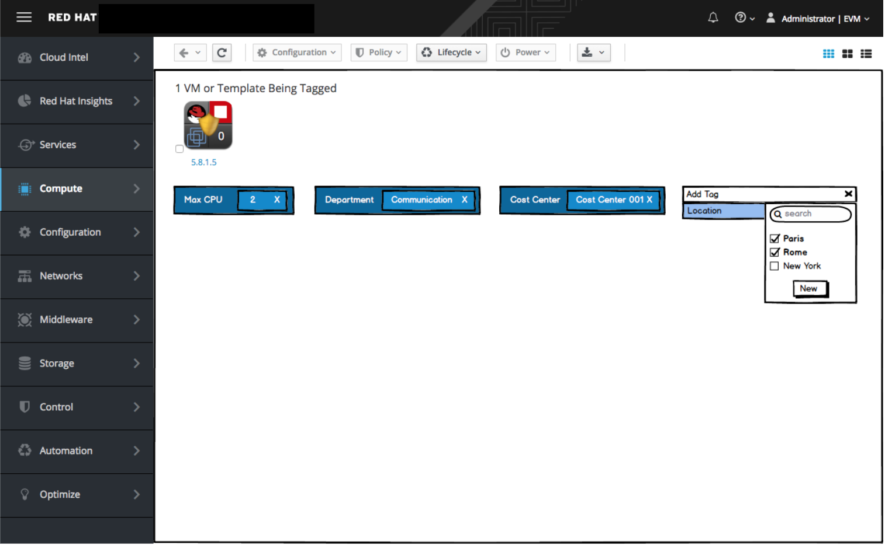

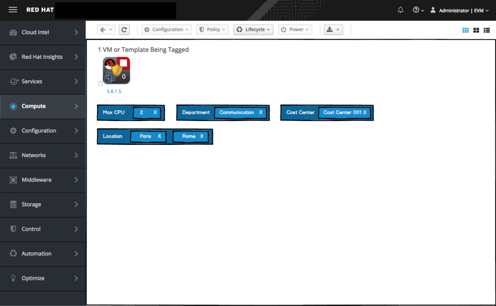

* How would you describe how difficult or easy it was to complete this task? (Very Difficult - Very Easy)
* How satisfied are you with using this application to complete this task? (Very Dissatisfied - Very Satisfied)
* How would you rate the amount of time it took to complete this task? (Too Much Time - Too Little Time)
* Is there any use case when you would want to use a free form tag? (Any example when any of these - key, value - is missing? Do you use it?)

## User Interview
*You have just experienced “On-the-fly” tagging, which means tags are added and modified on the fly without a centralized location.*

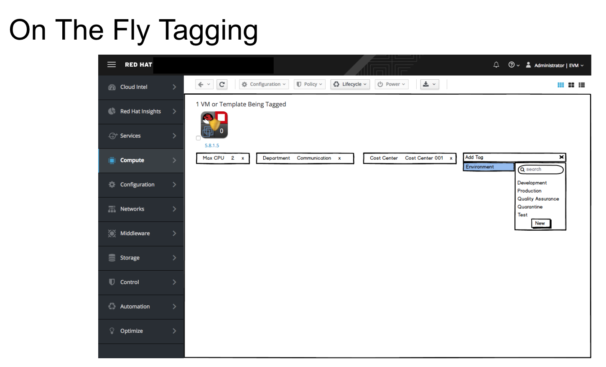

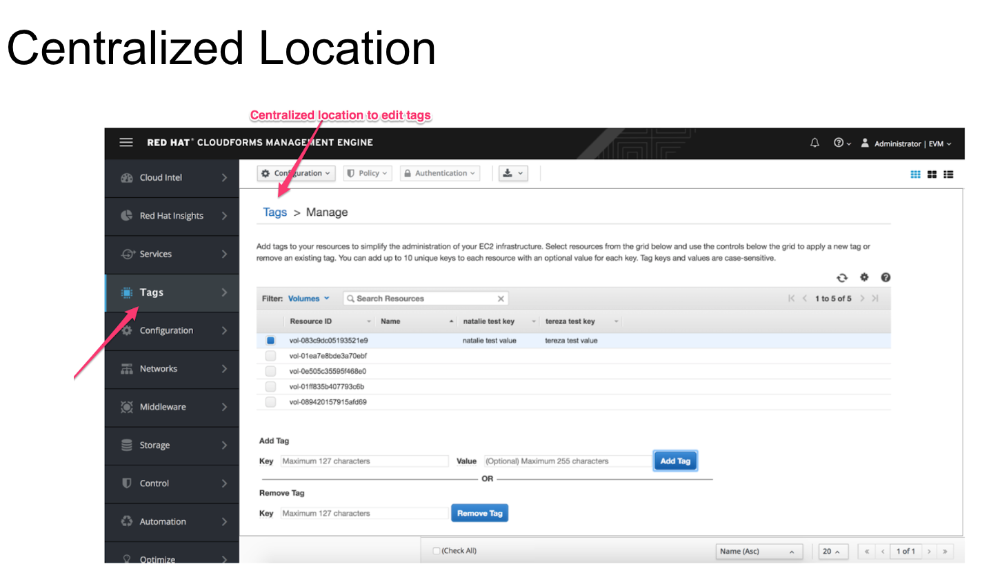

* Which method do you prefer, centralized location for tagging or on-the-fly tagging?
* Can you think of any scenario where centralized tagging would be beneficial?
* What other actions would you like to be available with tags?

## Task 3
*In this task you have searched using the tags shown in the search bar. You get the results shown. Can you create a new tag, Department - Accounting, and apply it to already found VMs?*

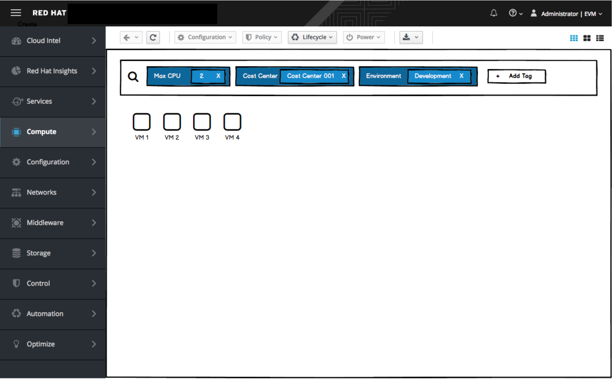

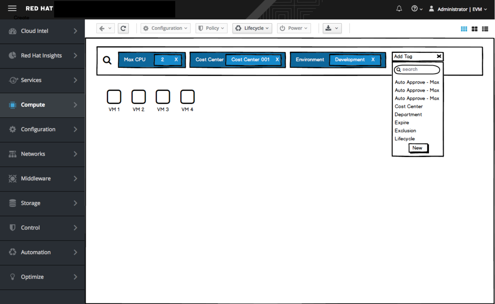

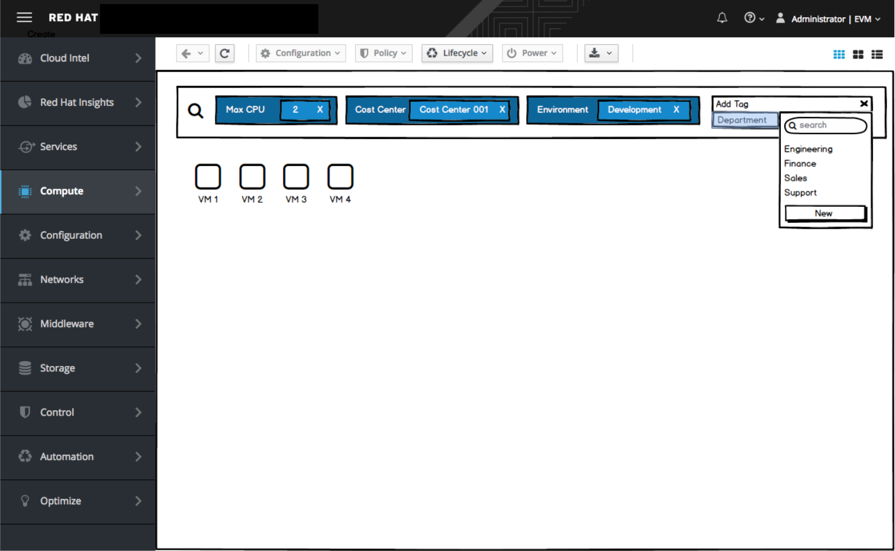

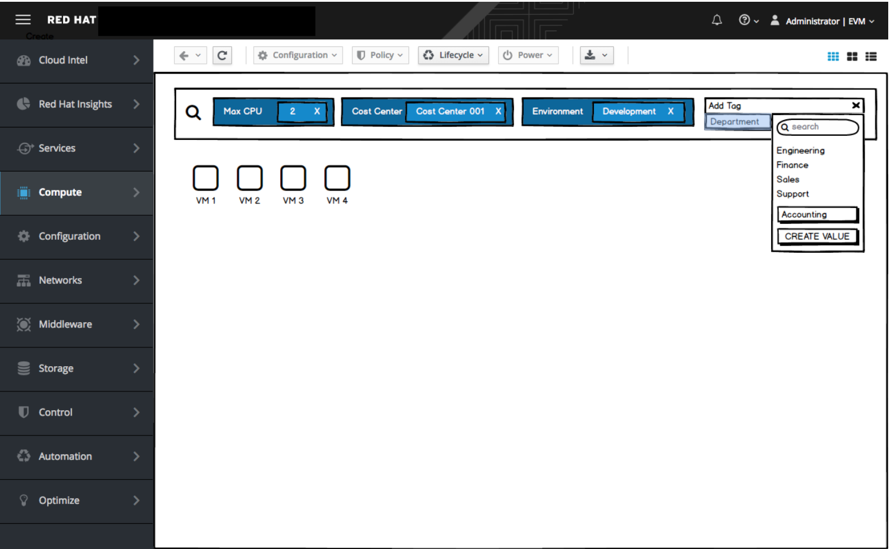

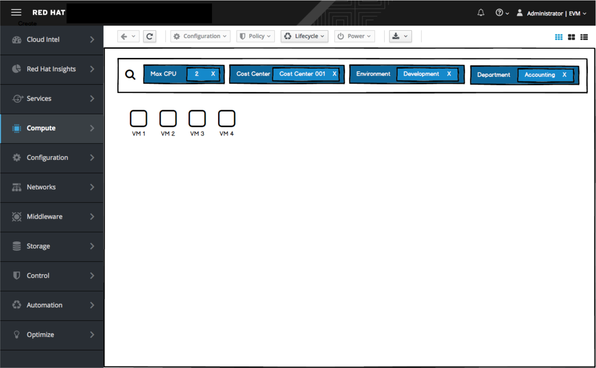

* How would you describe how difficult or easy it was to complete this task? (Very Difficult - Very Easy)
* How satisfied are you with using this application to complete this task? (Very Dissatisfied - Very Satisfied)
* How would you rate the amount of time it took to complete this task? (Too Much Time - Too Little Time)
* Can they figure out how to search by tags?
* Do they like searching by tags?
* Can they create on a new value element on the fly
* Is it easy to define a new value on the fly?

## Task 4
*In this task you will be switching your view to Topology view. Once you do so, do you find this view valuable? Can you remove Cost Center tag?*

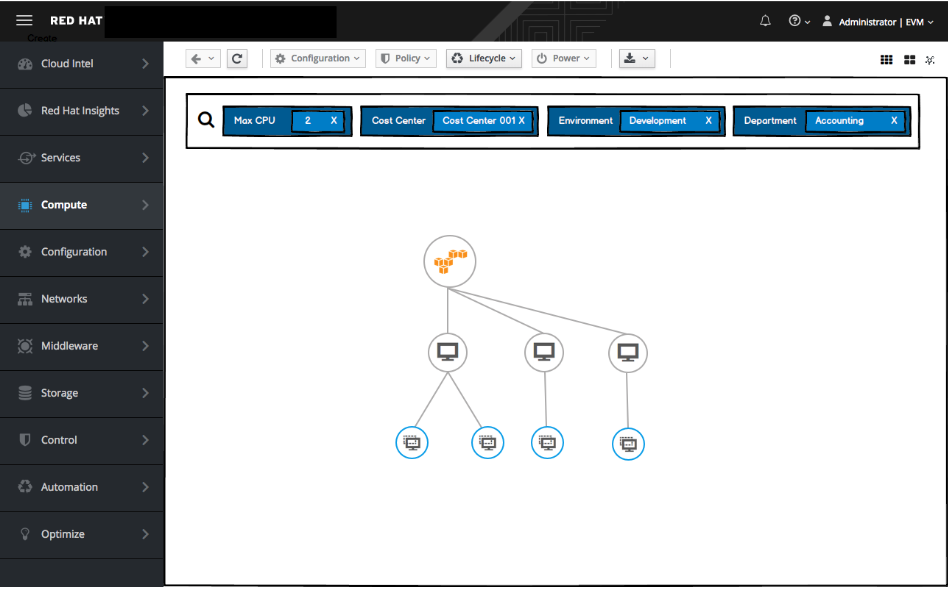

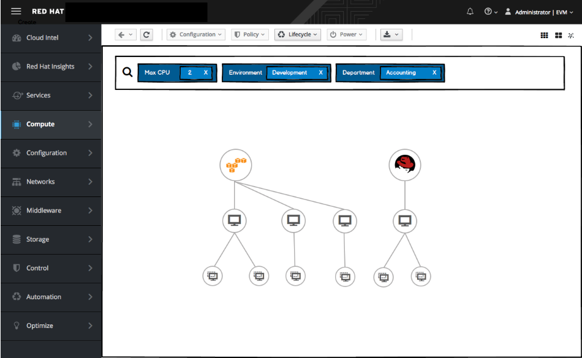

* How would you describe how difficult or easy it was to complete this task? (Very Difficult - Very Easy)
* How satisfied are you with using this application to complete this task? (Very Dissatisfied - Very Satisfied)
* How would you rate the amount of time it took to complete this task? (Too Much Time - Very Little Time)
* Can they figure out how to switch a view to Topology View?
* Have you used Topology view before?
* If yes...what do you like / dislike about Topology View?
* Does the Topology view provide new information? Is it helpful to see the connections in this context?
* When you removed the Cost Center tag, you got different results that were reflected in this view. Is this a relevant information to see?
* Is it easy to see connection between elements displayed on the topology view? What use cases do you use topology view in?

## Follow-up questions
* The tagging control helped me narrow down the data set I was viewing. (Strongly Disagree - Strongly Agree)
* I found the interface to be consistent. (Strongly Disagree - Strongly Agree)
* Interacting with the tagging control was complicated.(Strongly Disagree - Strongly Agree)
* I understood how to interact with and navigate through the tagging control. (Strongly Disagree - Strongly Agree)
